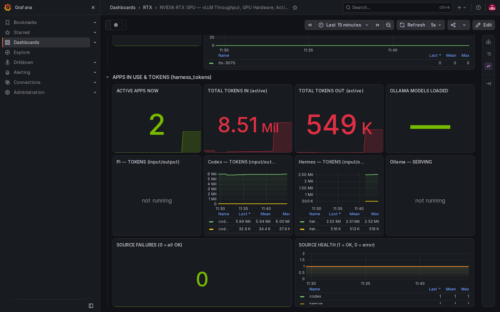

# NVIDIA RTX GPU — vLLM Grafana Dashboard

A Grafana dashboard and self-contained monitoring stack for **any NVIDIA RTX (GeForce) GPU** running [vLLM](https://github.com/vllm-project/vllm), plus per-process GPU activity so you can see *what's using your GPU right now* — and a **per-tool token tracker** for Pi, Codex (CLI + desktop app), Hermes, Claude Code, and Ollama.

Ported from [`RodriMora/dgx-spark-grafana-dashboard`](https://github.com/RodriMora/dgx-spark-grafana-dashboard) (which targeted the NVIDIA **DGX Spark**, a GB10 workstation). That original assumes DGX-only telemetry — thermal-limit, throttle-reason counters, unified CPU/GPU memory — none of which exist on a consumer GeForce card. This fork adapts it to RTX, adds a "GPU Activity" row and a "Apps in use & tokens" row, and drops the dead sections (cloud-equivalent cost cards, spec-decode panels).



---

## What it monitors

| Row | Source | What you see |
|---|---|---|
| **Inference / vLLM** | vLLM `/metrics` | tokens/sec, TTFT/TPOT percentiles, KV-cache %, prefix-cache hit rate, request hopper, latency distributions, throughput |
| **Node** | `node_exporter` | CPU / memory / disk / network / filesystem per host |
| **RTX GPU HARDWARE** | `nvidia_gpu_exporter` | GPU temp, power draw, SM clock, utilization, VRAM used-vs-total, power headroom |
| **GPU ACTIVITY** | `nvidia_gpu_exporter --collect.compute-apps` | **per-process** count of compute contexts — *who's on the GPU*, app-agnostic |
| **APPS IN USE & TOKENS** | `harness_tokens.py` (local exporter) | active-app count + per-tool token totals for Pi, Codex, Hermes, Claude Code, Ollama — panels hide when a tool isn't running |

The **GPU Activity** row is the reason this works for *any* app, not just vLLM: anything that opens a CUDA context (a game, a training run, Ollama, llama.cpp) shows up without the app needing to self-report anything.

---

## Architecture

```
                       ┌─────────────── scrape ────────────────┐
   vLLM  :8000 ────────┤                                       │
   node_exporter :9100 ┤───►  Prometheus :9090  ───►  Grafana :3001
   nvidia_gpu_exporter :9835  (10s scrape)          (dark NVIDIA theme)
   harness_tokens  :9257  (Pi/Codex/Hermes/Ollama)
   claude-code     :9464  (OTLP prometheus exporter, optional)
```

- **Everything runs in WSL2** (Ubuntu), as **user-level systemd units** (`systemctl --user`) — no root for the services.
- Prometheus scrapes the three core targets plus `harness_tokens`; Grafana renders the dashboard from a `prometheus` datasource (UID `prometheus`, hard-coded by the dashboard).
- Your browser reaches Grafana at `http://localhost:3001` (WSL2 auto-forwards localhost ports to Windows).

---

## Requirements

| Component | Notes |
|---|---|
| WSL2 (Ubuntu) with **systemd** | `ps -p 1 -o comm=` should print `systemd` |
| NVIDIA driver + CUDA passthrough | `nvidia-smi` must work *inside* WSL (`/usr/lib/wsl/lib`) |
| `node_exporter` | static binary → `:9100` |
| `nvidia_gpu_exporter` | static binary → `:9835` (nvidia-smi backend) |
| Prometheus | → `:9090` |
| Grafana | → `:3001` (3000 is commonly taken) |
| vLLM + a quantized model | see [vLLM setup](#vllm-setup) |
| `build-essential` (gcc/g++/make) | one-time, for vLLM's JIT kernels |

---

## Install

### 1. Monitoring stack (sudo-free)

```bash
./deploy/install.sh
```

Installs version-pinned node_exporter, nvidia_gpu_exporter, Prometheus, and Grafana under
`~/opt/`, provisions the target files and dashboard JSON, renders the user-level systemd units,
and enables the five monitoring services. Application versions are installed side-by-side;
Prometheus history is kept separately in `~/opt/prometheus-data/` so upgrades do not erase it.

All web endpoints bind to `127.0.0.1`. On first install, Grafana receives a random admin password,
printed once and stored with mode 600 in `~/.config/rtx-vllm-grafana/grafana.env`. Set
`GRAFANA_ADMIN_PASSWORD` before running the installer if you want to provide your own initial
password. The optional vLLM service is not enabled automatically.

### 2. vLLM (one-time, needs `build-essential`)

```bash
sudo apt-get update && sudo apt-get install -y build-essential   # gcc/g++/make
uv venv ~/vllm --python 3.12
uv pip install --python ~/vllm/bin/python -U pip vllm nvidia-cuda-nvcc ninja
# download a model (quantized so it fits in 8 GB):
~/vllm/bin/python -c "from huggingface_hub import snapshot_download; snapshot_download('Qwen/Qwen2.5-3B-Instruct-GPTQ-Int4', local_dir='$HOME/models/Qwen2.5-3B-Instruct-GPTQ-Int4')"
systemctl --user enable --now vllm
```

`deploy/systemd/vllm.service` is pre-configured for WSL2 (see gotchas below).

---

## Verify

```bash
# 1. offline release-integrity checks (also run in GitHub Actions)
python3 scripts/check-release.py

# 2. live: run every panel's PromQL through Grafana's own engine
python3 scripts/validate-panels.py

# 3. pixel-level: screenshot the rendered dashboard and inspect it
npm ci
npx playwright install chromium
npx playwright install-deps chromium
node scripts/screenshot.js                  # writes screenshots/dashboard.png
```

The offline check catches packaging and wiring regressions without requiring a GPU. The live
validator proves that queries parse and return data against the machine on which it is run; its
counts depend on which optional tools and model servers are active. The screenshot catches
pixel-level problems that a data-only check cannot. A successful CI run alone is not evidence that
the full stack was exercised on fresh WSL2 hardware.

---

## vLLM setup — the WSL2 gotchas (all hit in practice)

vLLM 0.28 on WSL2 needs several non-obvious settings. They are baked into
`deploy/systemd/vllm.service`:

| Symptom | Cause | Fix |
|---|---|---|
| `Free memory … less than desired GPU memory utilization` | model + KV cache exceed 8 GB | `--gpu-memory-utilization 0.85` + a **quantized** model |
| `UVA is not available` | WSL2 pins memory disabled by default | `VLLM_WSL2_ENABLE_PIN_MEMORY=1` |
| `Failed to find C compiler` | inductor JIT needs gcc | install `build-essential` |
| `Could not find nvcc … /usr/local/cuda` | only the driver is in WSL, not the toolkit | `pip install nvidia-cuda-nvcc` + set `CUDA_HOME` |
| `No such file or directory: 'ninja'` | flashinfer JIT needs ninja | `pip install ninja` |
| `CUDA compiler and toolkit headers are incompatible` | nvcc 13.3 vs torch 13.0 mismatch | `VLLM_USE_FLASHINFER_SAMPLER=0` |
| KV-cache too small for 32k context | 7B model leaves ~0.2 GB for KV cache | use **3B GPTQ-Int4**, `--max-model-len 16384` |

> **Model choice matters on 8 GB.** A 7B unquantized model (~6.6 GB in memory) leaves almost no
> room for KV cache, so the KV-cache/prefix-cache panels peg at 0. `Qwen2.5-3B-Instruct-GPTQ-Int4`
> (~2 GB) leaves ~4 GB of KV cache and makes every panel meaningful. Note that
> `meta-llama/Llama-3.2-3B-Instruct` is **gated** (needs a HF token + license acceptance).

---

## Portability matrix — DGX Spark → RTX

| Original (DGX) | RTX (GeForce) | Action |
|---|---|---|
| `nvidia_smi_temperature_gpu_tlimit` | `T.Limit Temp: N/A` | removed → use static temp thresholds |
| `nvidia_smi_clocks_event_reasons_*` (throttle bitmask + counters) | absent on GeForce | removed |
| `node_hwmon_temp_celsius{chip="nvme_nvme0"}` | no host hwmon in WSL | removed |
| unified CPU/GPU memory | dedicated VRAM | added VRAM used-vs-total panel |
| `vllm:gpu_cache_usage_perc` | renamed in V1 | → `vllm:kv_cache_usage_perc` |
| `vllm:time_per_output_token_seconds` | renamed in V1 | → `vllm:request_time_per_output_token_seconds` |
| `vllm:num_requests_swapped` | removed in V1 | request-hopper panel dropped `swapped` |
| label `dgx_spark="true"` | — | → `rtx_gpu="true"` |

Counter names keep their `_total` suffix (Prometheus appends it automatically) — do **not** strip it.

---

## Harness token tracker (Pi · Codex · Hermes · Ollama · Claude Code)

`scripts/harness_tokens.py` reads token usage from the local AI tools and serves it as Prometheus
metrics on `:9257` (systemd user unit `harness-tokens.service`). Each tool's panels **hide when it
isn't running** — driven by a `harness_active` flag (recent activity OR running process).

| Tool | Data source | Notes |
|---|---|---|
| Pi | `~/.pi/agent/sessions/*.jsonl` | clean `usage{input,output,cacheRead,...}` + cost |
| Codex (CLI + desktop) | `~/.codex/sessions` + `/mnt/c/Users/<u>/.codex/sessions` (auto-detected) | `payload.info.last_token_usage` (per-turn); **recent-activity** window, not all-time — long desktop rollouts report implausible cumulative totals |
| Hermes | `state.db` (SQLite, copied read-only) | `sessions` table: `input_tokens`, `output_tokens`, `cache_*`, `estimated_cost_usd` |
| Ollama | `localhost:11434/api/tags` + `/api/ps` | **no token metrics** — shows installed + loaded models only |
| Claude Code | OTLP `prometheus` exporter (`:9464`) | accurate; JSONL is broken (~100× undercount). See below. |

Codex and Hermes paths are **auto-discovered** (WSL home + every `/mnt/c/Users/*` Windows
profile); override with the `CODEX_HOME` / `HERMES_HOME` env vars if your layout differs.

> **Cost figures are estimates.** `harness_cost_usd_total` comes from each tool's own
> `estimated_cost_usd`/`cost` fields, which are pricing-table estimates that can drift
> between sessions (and Codex reports $0 — it doesn't emit pricing). Treat them as
> directional, not billing-accurate. Token counts are authoritative.

**Graceful errors:** every source is read independently — a missing/​unreadable source (Pi's
dir gone, Hermes DB locked, Ollama not installed, a session file mid-write) degrades to empty
data rather than failing the scrape. The collector always returns HTTP 200, and emits
`harness_source_success{harness="…"}` (1/0) so a failing source is visible, never silent.
`harness_scrape_error` (1) flags a catastrophic render failure; the `/metrics` endpoint never
drops the connection.

**Claude Code caveat:** its JSONL `usage.input_tokens` is a known-unfixed placeholder (undercounts
~100×). The reliable path is OTLP — set in `~/.bashrc` (already added by the installer):

```bash
export CLAUDE_CODE_ENABLE_TELEMETRY=1
export OTEL_METRICS_EXPORTER=prometheus   # → http://localhost:9464/metrics (live, resets on exit)
```

**Removed from the original (DGX) dashboard:** the 4 cloud-equivalent cost cards (Claude Opus 5 /
Claude Sonnet 5 / DeepSeek V4 Flash / "GPU energy" — always $0.00) and the 2 spec-decode panels
(feature never enabled). Real token tracking supersedes them.

---

## Repo layout

```
dashboards/
  dgx-spark-vllm.json        # upstream (source)
  rtx-vllm.json              # adapted output (generated)
scripts/
  build-rtx-dashboard.py     # regenerate rtx-vllm.json from upstream + apply fixes
  add-gpu-hardware-panels.py # upstream generator (reference)
  harness_tokens.py          # Pi/Codex/Hermes/Ollama token exporter (:9257)
  validate-panels.py         # deterministic panel validation via /api/ds/query
  screenshot.js              # pixel-level validation (Playwright)
deploy/
  install.sh                 # sudo-free monitoring-stack installer
  prometheus.yml
  grafana/provisioning/…     # datasource + dashboard file providers
  systemd/…                  # node-exporter, nvidia-gpu-exporter, prometheus, grafana, vllm, harness-tokens
screenshots/                 # sample renders
```

## Release scope

This project is intended to ship first as a preview for WSL2 systems with NVIDIA CUDA passthrough.
Before tagging a release, verify the installer from a clean WSL2 user account, confirm every
Prometheus target is healthy, run both validators, and inspect the generated screenshots. CI is an
offline integrity gate and does not replace that hardware smoke test.

## Security

The default services are loopback-only. Do not change them to `:PORT` or `0.0.0.0:PORT` unless
you also add appropriate authentication and firewall policy. The token exporter reads local tool
session metadata and must not be exposed to untrusted networks. Report security-sensitive issues
privately to the repository owner rather than opening a public issue.

## Attribution

Based on [`RodriMora/dgx-spark-grafana-dashboard`](https://github.com/RodriMora/dgx-spark-grafana-dashboard)
(itself derived from `darkmatter2222/DGX_Spark_Public_Docs`). The upstream does not declare a
license for the panel work; the scripts and documentation in this repo are MIT (see [LICENSE](LICENSE)).
